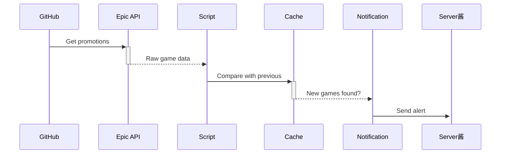

# Epic Free Games Notifier 🎮

Get automated notifications for free games on the Epic Games Store, delivered via [Server酱](https://sct.ftqq.com/) to your WeChat.


*(Example notification showing current and upcoming games)*

## Features ✨
- ✅ **Daily automatic checks** at 16:30 UTC
- 🔍 Clear separation between **claimable now** vs **coming soon**
- 💾 Smart caching prevents duplicate alerts
- 🛡️ No servers needed - runs entirely on GitHub

## One-Click Setup 🚀

### 1️⃣ Fork This Repository
Click ["Fork"](https://github.com/zhongminlin/epic-games-notifier/fork) at the top-right → Create your copy

### 2️⃣ Get Your Server酱 Key
1. Visit [Server酱](https://sct.ftqq.com/) (login with GitHub)
2. Copy your `SendKey` (looks like `SCT123456...`)

### 3️⃣ Configure Secrets
In your forked repo:
1. Go to **Settings** → **Secrets and variables** → **Actions**
2. Click **New repository secret**:
   - Name: `SERVER_CHAN_KEY`
   - Value: Paste your SendKey

### 4️⃣ Enjoy Automatic Alerts!
The system will:
- **First run**: Show all current + upcoming games  
- **Daily checks**: Only notify about new free games + upcoming titles  
- **Manual runs**: Use "Run workflow" button for instant checks

## Technical Details 🔧


## Troubleshooting 🛠️
| Symptom | Fix |
|---------|-----|
| No notifications | 1. Test Server酱 key manually:<br>`curl -X POST "https://sctapi.ftqq.com/YOUR_KEY.send" -d "title=Test&desp=Hello"`<br>2. Check Actions → Run notifier → Debug output |
| Wrong games shown | 1. Delete `games_cache.json`<br>2. Manually trigger workflow |
| API errors | Wait 1 hour (Epic sometimes rate-limits) |

## Advanced Customization ⚙️
- **Change schedule**: Edit `cron` in [check.yml]
- **Test locally**:
  ```bash
  SERVER_CHAN_KEY=your_key python epic_notifier.py
  ```
- **Debug output**: See workflow's "Verify" step

---

Enjoy your free games! 🎁  
*Consider starring this repo if you find it useful!*