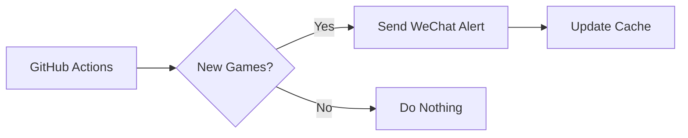

# Epic Free Games Notifier 🎮

Get automated notifications for free games on the Epic Games Store, delivered via [Server酱](https://sct.ftqq.com/) to your WeChat.

*(Example notification showing current and upcoming games)*

## Features ✨
- ✅ **Daily automatic checks** at 16:30 UTC
- 🔍 Clear separation between **claimable now** vs **coming soon**
- 💾 Smart caching prevents duplicate alerts
- 🛡️ No servers needed - runs entirely on GitHub

## One-Click Setup 🚀

### 1️⃣ Fork This Repository
Click ["Fork"](https://github.com/zhongminlin/epic-games-notifier/fork) at the top-right → Create your copy

### 2️⃣ Get Your Server酱 Key
1. Visit [Server酱](https://sct.ftqq.com/) (login with GitHub)
2. Copy your `SendKey` (looks like `SCT123456...`)

### 3️⃣ Configure Secrets
In your forked repo:
1. Go to **Settings** → **Secrets and variables** → **Actions**
2. Click **New repository secret**:
   - Name: `SERVER_CHAN_KEY`
   - Value: Paste your SendKey

### 4️⃣ Done! 
The system will:
- First run: Notify about all current free games
- Subsequent runs: Only alert for new additions

## Need Help? 🛠️
| Issue | Solution |
|-------|----------|
| No notifications | 1. Check Actions tab for errors 2. Verify Server酱 key |
| Wrong timing | Edit `cron: '30 16 * * *'` in [.github/workflows/check.yml](.github/workflows/check.yml) |

## How It Works 🔍
1. GitHub Actions runner spins up daily
2. Script checks Epic's API
3. Compares with cached games
4. Sends only new findings via Server酱

---

Enjoy your free games! 🎁  
*Consider starring this repo if you find it useful!*